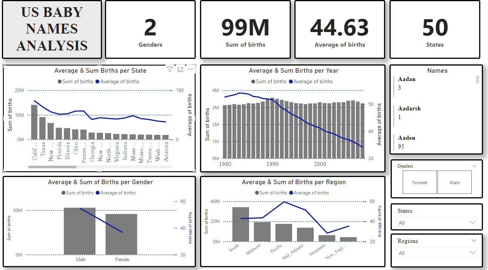

## **US BABY NAMES ANALYSIS**

PowerBI dashboard:

### **Observations**
- California is highest in terms of total births and average births.
- California has the highest deviation i.e, it has a large spread in data points.
- Year 1990 has the highest sum total births
- Year 1983 has the highest mean births
- Year 1985 has the highest deviation
- Jordan is the highest reoccurring name count
- Females are the highest gender
- California females have the highest count
- The region named South is the most reoccuring region
- South region is the highest in terms of total births
- Pacific region has the highest mean births 
- Pacific region has the highest deviation in births 
- South region is the highest gender count
- Females have the highest count in South
- Year 2007, in the South region has the highest summation of births
- Year 1990, in the Pacific region has the highest mean births
- Year 1990, in the Pacific region has the highest deviation in births
- Females and Males have the highest count in the South region
- Year 2008 has the highest count
- Males have the highest average, total and deviation births
- Babies named Michael have the highest births and is in the state of California and the Pacific region